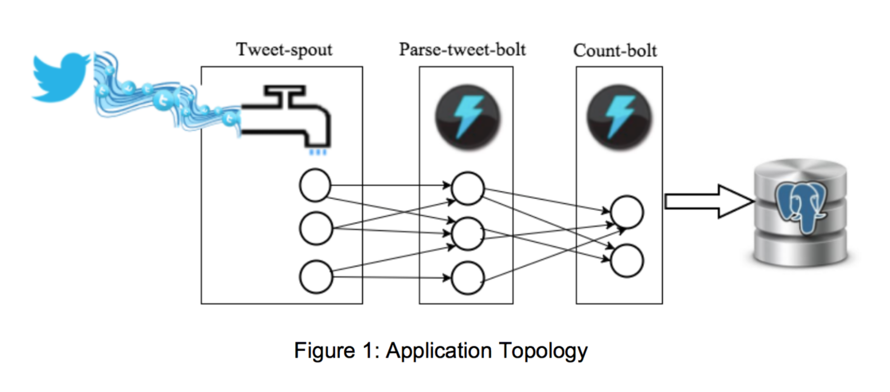

# Twitter Streaming Architecture

This application utilizes Apache Storm and the Twitter API, accepting text as input from continuously streaming tweets, parses through them, and then counts the total number of times each word is used.

### Directory and File Structure
The Main Parent Directory is the ex2 directory, which contains the user defined python files, the architecture.md file, a README, as well as the storm application contained in "extweetwordcount". The storm application follows the cannonical structure of topologies, and src directories containing the tweet word count, and the bolts and spouts respectively.

The architecture is such that Apache Storm parses the streaming data, passing from a tweet spout, to a parse bolt, then to a wordcount bolt. The wordcount bolt then updates a postgres database, which can be queried by the serving layer via the finalresults.py and the histogram.py

### Dependencies:
- Apache Storm
- PostgreSQL
- Python 2.7x
- libraries: psycopg2, re, streamparse, tweepy

**File Dependencies:**
- finalresults.py - allows for lookup of all words or individual words
- histogram.py - serving file that allows you to see words with a frequency within a specified range.
- setup.sql - creates the tcount database if it doesn't already exist
- Twittercredentials.py - credentials that allow access to the twitter app
- Screenshots - examples of what the functioning prgram should look like

### How to Run the Application:
1. Make sure Postgres is running `/data/start_postgres.sh`
2. Clone the github respository `git clone git@github.com:rileyrustad/W205.git`
3. Navigate to the ex2 directory `cd ex2`
4. Edit the Twittercredentials.py file to us the Secret Key specific to your app.
4. Run the setup sql file `psql -d tcount -U postgres -f setup.sql
5. Start the application `streamparse run`
6. One enough data is collected press **ctrl-c**
7. To view the full results run `python finalresults.py`
8. To see the results of a specific word, pass a word into our script `python finalresults.py <word>` (insert your specific word instead of <word>)
9. To see the results of all words within a specified range run `python histogram.py <#1>,<#2> 

  
