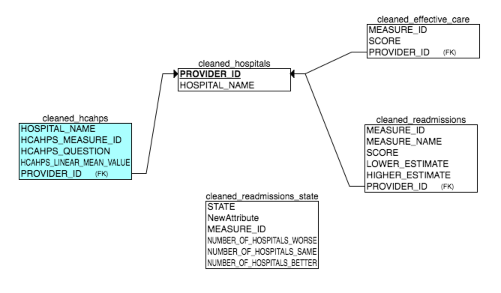

# Exercise 1 - Riley Rustad

In this assignment I'll be exploring the Hospital Consumer Assessment of Healthcare Providers and Systems - 2016 Dataset. I'll be evaluating hospitals based on their scores on key measures.

### 0. Log in
1. SSH into your UCB Spring AMI on AWS in the N. Virginia Region.
2. Mount EBS Volume and get HDFS running

```sh
mount -t ext4 /dev/<your device> /data
/root/start-hadoop.sh
/data/start_postgres.sh
su - w205
/data/start_metastore.sh
```

`3.` Download and unzip my git repository and navigate to the exercise_1 directory

I couldn't git clone for some reason without setting up ssh keys. Easier just to download

```sh
wget -O W205.zip https://github.com/rileyrustad/W205/archive/master.zip
unzip W205.zip
rm W205.zip
cd W205-master/exercise_1
```

### 1. Load the Data

1. Run the load_data_lake script. This unzips the data, strips the headers, and loads it into HDFS (See Comments in [Code](https://github.com/rileyrustad/W205/blob/master/exercise_1/loading_and_modelling/load_data_lake.sh) for additional detail)

```sh
loading_and_modelling/load_data_lake.sh
```

`2.` Run the hive_base_ddl.sql to load the tables in Hive (See Comments in [Code](https://github.com/rileyrustad/W205/blob/master/exercise_1/loading_and_modelling/hive_base_ddl.sql) for additional detail)

```sh
hive -f loading_and_modelling/hive_base_ddl.sql
```

### 2. Transform the Data. For the most part this is parsing data down to only the columns that we need and casting some columns to new data types. [Code](https://github.com/rileyrustad/W205/blob/master/exercise_1/transforming/transform.sql)

```sh
hive -f transforming/transform.sql
```

Here is the ER Diagram for the schema that I designed for my tables. 



### 3. Answer the Questions

##### What hospitals are models of high-quality care? That is, which hospitals have the most consistently high scores for a variety of procedures.

Given that we're prompted to look for high scores for a variety or procedures, I would say that the best place to look is the "Timely and Effective - Hospital" data. It measures individual hospitals on 22 different procedures, and gives them a score. That said, the scores aren't uniform some only go up to 100, and others range well beyond 1000. They'll need to be normalized if we want to do anything with them.

My plan is to create normalized values between 0 and 1 for each of these procedures/hospital combinations, and then average them for each hospital. There were some interesting/hacky things that I had to do to get there, but I was able to score them. (See Comments in [Code](https://github.com/rileyrustad/W205/blob/master/exercise_1/investigations/best_hospitals/best_hospitals.sql) for additional detail)

Run the Code:

```sh
hive -f investigations/best_hospitals/best_hospitals.sql
hive -e 'select * from best_hospital limit 10;'
```

1. Unstack the procedures so that each row corresponds to a hospital, and each column corresponds to a procedure
2. Find the Min Max and Range of each procedure distribution.
3. Normalize each data point between 0 and 1 by it's range (Value - Min) / (Max - Min)
4. Average the values across each row.(This ended up being a huge sticking point trying to deal with NULL values. The solution ended up being to use the NVL() function and conditional statments)
5. Join the Averages with the original table on Provider_ID to get the Hospital Names. Sort Decending, and you should have the top 10 best hospitals.

Here are the results:

|Provider ID|Hospital Name| Score |
| --- | --- | --- |
| 050424 | SCRIPPS GREEN HOSPITAL | 0.797940074906367|
| 050512 | KAISER FOUNDATION HOSPITAL - FREMONT | 0.6917428318979675|
| 050510 | KAISER FOUNDATION HOSPITAL | 0.6878128761204184|
| 050070 | KAISER FOUNDATION HOSPITAL - SOUTH SAN FRANCISCO | 0.6843440559351351|
| 301309 | MONADNOCK COMMUNITY HOSPITAL | 0.6703627039008483|
| 161345 | OSCEOLA COMMUNITY HOSPITAL | 0.631953083199572|
| 050137 | KAISER FOUNDATION HOSPITAL - PANORAMA CITY | 0.6070255410071664|
| 251319 | HOLMES COUNTY HOSPITAL AND CLINICS | 0.5998573481116585|
| 010087 | UNIVERSITY OF SOUTH ALABAMA MEDICAL CENTER | 0.5965184967913776|
| 050075 | KAISER FOUNDATION HOSPITAL - OAKLAND/RICHMOND | 0.5959229496299197|

SPOILER ALERT: I found that the aggregated scores from this step negatively correlated with the survey data, which I found suspicious. One would expect higher scores would positively correlate with positive survey data. It makes me think that maybe some of those scores might not all be positively correlated measures, or that there are some really skewed distributions. 

After Further Research, it turns out that the scores in the "Timely and Effective Care" dataset are mixed positive and negative measures. In order to correct for this I ran a similar analysis on "Readmissions and Deaths" dataset, which explicitly says "Lower percentages for readmission and mortality are better". So this time we should expect a negative correlation.

```sh
hive -f investigations/best_hospitals/best_hospitals_readmissions.sql
hive -e 'select * from best_hospital limit 10;'
```

Note: I had a difficult time getting hive to output results when the final query was in the script, so I had to run the command in a separate line.

Here were the results:

330395	ST JOHN'S EPISCOPAL HOSPITAL AT SOUTH SHORE	0.6601431475730346
180050	HARLAN ARH HOSPITAL	0.6492104012633981
100260	ST LUCIE MEDICAL CENTER	0.6478202932584024
330014	JAMAICA HOSPITAL MEDICAL CENTER	0.6410833818020275
330027	NASSAU UNIVERSITY MEDICAL CENTER	0.6251373459335048
100157	LAKELAND REGIONAL MEDICAL CENTER	0.6102583314945108
330221	WYCKOFF HEIGHTS MEDICAL CENTER	0.6040172225847332
150176	KENTUCKIANA MEDICAL CENTER LLC	0.5976398550510722
181328	BARBOURVILLE ARH HOSPITAL	0.5948889850982291
251332	PIONEER HEALTH SERVICES OF NEWTON	0.5910228274027837


##### What states are models of high-quality care?

I did the identical procedure as above just switching to the "Readmissions and Deaths - State" dataset. There were only a few tweaks that I needed to make. Here's the [Code](https://github.com/rileyrustad/W205/blob/master/exercise_1/investigations/best_states/best_states.sql).

```sh
hive -f investigations/best_states/best_states.sql
hive -e 'select * from best_state limit 10;'
```

Here were my results:

TODO

##### Which procedures have the greatest variability between hospitals? 
I considered normalizing the data like in the previous problem, but since variance is dependent upon how spread out the data is, I thought that that might skew the results. I recognize that each procedure is fundamentally different, has different ranges, distributions, etc. That said, I've interpreted the question of variability as which procedure has the highest variance. 

This becomes a simple query. Find the variance of the scores, and group them by measure ID.

[Code](https://github.com/rileyrustad/W205/tree/master/exercise_1/investigations/hospital_variability)

```sh
hive -f investigations/hospital_variability/hospital_variability.sql
select * from variablity limit 10;
```

Here were my results:

TODO

##### Are average scores for hospital quality or procedural variability correlated with patient survey responses? 

I had originally chosen the "Timely and Effective" dataset to run this analysis, and got a negative correlation. After further exploration, that dataset has both positive and negative measures, making it difficult to arrive at a confident answer. I chose to run the correlation on the readmissions data instead. This also produced a negative correlation, but that is to be expected since the report states that "Lower percentages[SCORES] for readmission and mortality are better." Overall we did see that as deaths and readmissions went down, that the survey results tended to be better.[Code](https://github.com/rileyrustad/W205/blob/master/exercise_1/investigations/hospitals_and_patients/hospitals_and_patients.sql)

```sh
hive -f investigations/hospitals_and_patients/hospitals_and_patients.sql
hive -e "SELECT corr(a.SCORE, b.SCORE) FROM best_hcahps a INNER JOIN avg_readmissions b on a.PROVIDER_ID = b.PROVIDER_ID;"
```

Here were my results:

TODO

### Further Investigations

Given more time I'd like to split out the positive and negative measures of "Timely and Effective Care" and run analysis on them separately. See Table Below for Broken out measures.

I also noticed that there were footnotes in most of the datasets, which gave more information about the sampling for specific measures. Things like "The number of cases/patients is too few to report.", "Data submitted were based on a sample of cases/patients.", and  "Results are based on a shorter time period than required." As of this point, my analysis doesn't take any of those into account. This information could be used to qualify/disqualify or maybe weight data to get a more accurate model.

Last, I'd like to dig into the payments datasets to see whether the cost of a procedure correlates with the quality of the care one recieves.

| Measure ID | +/- | Measure Description |
| --- | --- | --- |
| ED-1b | Negative | Average (median) time patients spent in the emergency department, before they were admitted to the hospital as an inpatient (alternate Measure ID: ED-1) |
| ED-2b | Negative | Average (median) time patients spent in the emergency department, after the doctor decided to admit them as an inpatient before leaving the emergency department for their inpatient room (alternate Measure ID: ED-2) |
| EDV | NULL | Emergency department volume (alternate Measure ID: EDV-1) |
| IMM-2 | Positive |Patients assessed and given influenza vaccination |
| IMM-3  | Positive |Healthcare workers given influenza vaccination (alternate Measure ID: IMM-3_OP_27_FAC_ADHPCT) |
| OP-1 | Negative |Median time to fibrinolysis. (Note:Not displayed on Hospital Compare, ended up being null in all fields)|
| OP-2 | Positive |Outpatients with chest pain or possible heart attack who got drugs to break up blood clots within 30 minutes of arrival |
| OP-3b | Negative |Average (median) number of minutes before outpatients with chest pain or possible heart attack who needed specialized care were transferred to another hospital |
| OP-4 | Positive |Outpatients with chest pain or possible heart attack who received aspirin within 24 hours of arrival or before transferring from the emergency department |
| OP-5 | Negative |Average (median) number of minutes before outpatients with chest pain or possible heart attack got an ECG |
| OP-18b | Negative |Average (median) time patients spent in the emergency department before leaving from the visit (alternate Measure ID: OP-18) |
| OP-20 | Negative |Average (median) time patients spent in the emergency department before they were seen by a healthcare professional |
| OP-21 | Negative |Average (median) time patients who came to the emergency department with broken bones had to wait before getting pain medication |
| OP-22 | Negative |Percentage of patients who left the emergency department before being seen |
| OP-23 | Positive |Percentage of patients who came to the emergency department with stroke symptoms who received brain scan results within 45 minutes of arrival |
| OP-29 | Positive |Percentage of patients receiving appropriate recommendation for follow-up screening colonoscopy |
| OP-30 | Positive |Percentage of patients with history of polyps receiving follow-up colonoscopy in the appropriate timeframe |
| OP-31 | Positive |Percentage of patients who had cataract surgery and had improvement in visual function within 90 days following the surgery |

