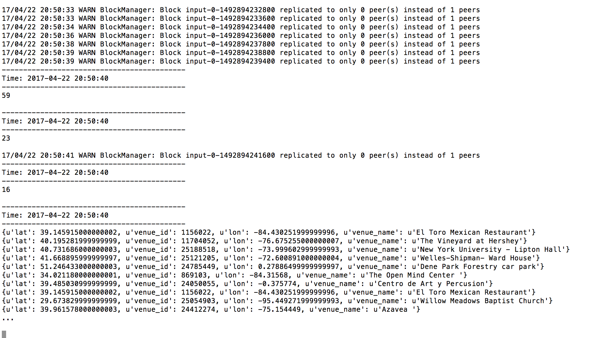

# Lab 10 - Spark Streaming

### Submission 1:
```python
from pyspark import SparkContext
from pyspark.streaming import StreamingContext

def less_than_5():
	if len(word) > 5:
		return True
	else:
		return False

ssc = StreamingContext(sc, 1)
lines= ssc.textFileStream("hdfs:///tmp/datastreams")
uclines = lines.map(lambda word: word.upper()).filter()
uclines.pprint()
ssc.start()
```

### Submission 2:
```python
from pyspark import SparkContext
rom pyspark.streaming import StreamingContext
import json

ssc = StreamingContext(sc, 10)
lines = ssc.textFileStream("file:///tmp/datastreams")
slines = lines.flatMap(lambda x: [ j['venue'] for j in json.loads('['+x+']') if 'venue' in j] )
cnt=slines.count()
cnt.pprint()
slines.pprint()
ssc.start()

slines.saveAsTextFiles("file:////data/lab_10", "txt")
```

### Submission 3:
**Bursty Streams**
One way to alleviate the stress of a bursty stream would be to have spill over instances and have whatever the inital instance can't handle flow into another application. I'm not sure how this would be implemented in spark, however, if we're adding more hardware, it might just make more sense to scale up the application and have more processing power available. Yet another option could be to save off the data and process it later, rather than while streaming it.

**Updates**
To update the application you'd need to have a seamless switch from the old application to the new application without any data loss. I would say first you want to test that each applicaiton obtains the same data while running in parallel. Then during the actual switch, you'd have a period of overlap where they're both pulling data. Last you could write a third processing program to clean up the data and delete the duplicates that were obtained by running both applications at the same time.

### Submission 4:
**Part a.**


**Part b.**
Having 10 second batches rather than 30 would decrease the amount of data that needs to be processed by the original DStream, which I assume has more memory constraints than the windowed DStream. It would also be more managable to distribute 10 second batches than 30 second batches.


