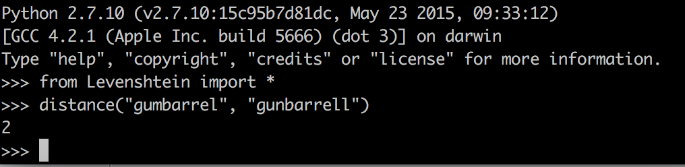

# Lab 8

**How many rows are missing a value in the "State" column? Explain how you came up with the number.**

5377 rows are missing a value in the State Column. They are listed as "Blank" in the left column when you select text facet for the State attribute.

**How many rows with missing ZIP codes do you have?**

There are 4362 rows with missing ZIP codes.

**If you consider all ZIP codes less than 99999 to be valid, how many valid and invalid ZIP codes do you have, respectively?**

There are 345175 valid 34961 invalid values less than 99999, excluding the 4362 blank values.

**Change the radius to 3.0. What happens? Do you want to merge any of the resulting matches?**

When the radius gets too big, then we start getting matches that shouldn't be merged in addition to the ones that are ok to merge. 

The resutling matches were:

* California and Cailfornia (merge)
* Alaska and alaska (merge)
* Tajikistan and Pakistan (don't merge)
* Indonesia and Micronesia (don't merge)

**Change the block size to 2. Give two examples of new clusters that may be worth merging.**

Example 1:
* California(84 rows)
* Caliofrnia(1 rows)
* Calfiornia(1 rows)
* Cailfornia(1 rows)

Example 2:
* Alaska(791 rows)
* alaska(4 rows)
* Alska(1 rows)

**Explain in words what happens when you cluster the "place" column, and why you think that happened. What additional functionality could OpenRefine provide to possibly deal with the situation?**

No clusters can be found when you run them on the "place" column. This is the case because all of the strings are so different that they can't be clustered easily like with location. OpenRefine could possibly provide geocoding based on the strings. It could estimate latitude and longitude coordinates based on the given string, or features derived from it.

**Submit a representation of the resulting matrix from the Levenshtein edit distance calculation. The resulting value should be correct.**

Excel Mental Math:

Python Confirmation

