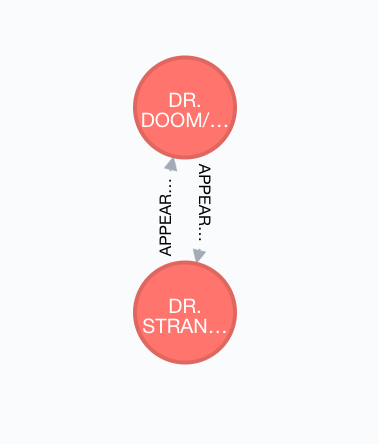
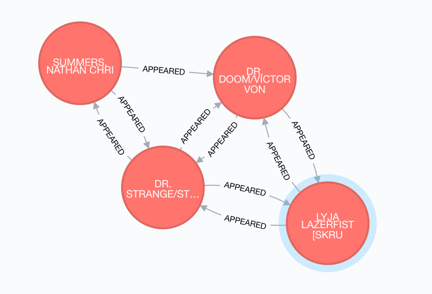

# Lab 9

1. __What is the shortest path between DR. STRANGE and DR. DOOM?__
	* The shortest path is 1 since they appear together.
	* command:```MATCH p=(strange:Hero {name: 'DR. STRANGE/STEPHEN'})-[:APPEARED*0..2]-(doom:Hero {name: 'DR. DOOM/VICTOR VON'}) RETURN p, length(p) ORDER BY length(p) LIMIT 1```
	*  
**2. List the 5 shortest paths between DR. STRANGE and DR. DOOM**
	* command:```MATCH p=(strange:Hero {name: 'DR. STRANGE/STEPHEN'})-[:APPEARED*0..2]-(doom:Hero {name: 'DR. DOOM/VICTOR VON'}) RETURN p, length(p) ORDER BY length(p) LIMIT 5```
	* 
**3. List 5 Friends of Friends with the most connections and COLOSSUS II.**
**4. Visualize 10 Friends of friends for IRON MAN**
**5. Discover how the Avengers grew over time from 5 to 10. Find team members starting with 5 and incrementing to 10. Who was added to the team? Is the resulting graph ever not fully connected?**
