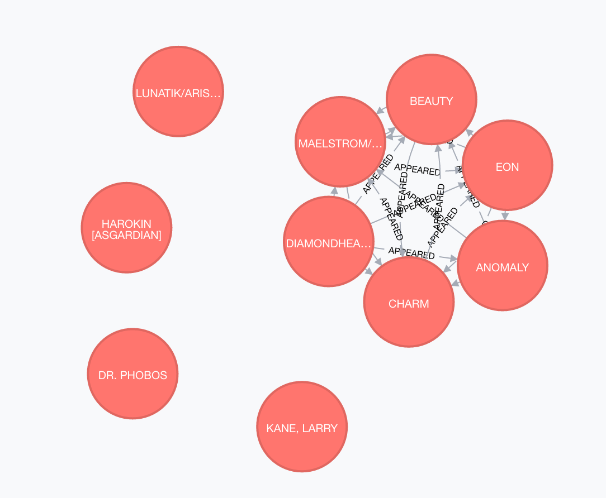

# Lab 9

1. __What is the shortest path between DR. STRANGE and DR. DOOM?__
	* The shortest path is 1 edge since they appear together 20 times.
	* command:```MATCH p=(strange:Hero {name: 'DR. STRANGE/STEPHEN'})-[:APPEARED*0..2]-(doom:Hero {name: 'DR. DOOM/VICTOR VON'}) RETURN p, length(p) ORDER BY length(p) LIMIT 1```
	 

2. **List the 5 shortest paths between DR. STRANGE and DR. DOOM**
	* The 5 shortest paths are different combinations of paths through two additional characters: SUMMERS NATAN CHRI and LYJA LAZERFIST [SKRU
	* command:```MATCH p=(strange:Hero {name: 'DR. STRANGE/STEPHEN'})-[:APPEARED*0..2]-(doom:Hero {name: 'DR. DOOM/VICTOR VON'}) RETURN p, length(p) ORDER BY length(p) LIMIT 5```

	```
╒══════════════════════════════╤═══════════╕
│"p"                           │"length(p)"│
╞══════════════════════════════╪═══════════╡
│[{"name":"DR. STRANGE/STEPHEN"│"1"        │
│,"degree":"777"},{"w":"8"},{"n│           │
│ame":"DR. DOOM/VICTOR VON","de│           │
│gree":"441"}]                 │           │
├──────────────────────────────┼───────────┤
│[{"name":"DR. STRANGE/STEPHEN"│"1"        │
│,"degree":"777"},{"w":"12"},{"│           │
│name":"DR. DOOM/VICTOR VON","d│           │
│egree":"441"}]                │           │
├──────────────────────────────┼───────────┤
│[{"name":"DR. STRANGE/STEPHEN"│"2"        │
│,"degree":"777"},{"w":"1"},{"n│           │
│ame":"SUMMERS, NATHAN CHRI","d│           │
│egree":"422"},{"name":"SUMMERS│           │
│, NATHAN CHRI","degree":"422"}│           │
│,{"w":"1"},{"name":"DR. DOOM/V│           │
│ICTOR VON","degree":"441"}]   │           │
├──────────────────────────────┼───────────┤
│[{"name":"DR. STRANGE/STEPHEN"│"2"        │
│,"degree":"777"},{"w":"3"},{"d│           │
│egree":"197","name":"LYJA LAZE│           │
│RFIST [SKRU"},{"degree":"197",│           │
│"name":"LYJA LAZERFIST [SKRU"}│           │
│,{"w":"10"},{"name":"DR. DOOM/│           │
│VICTOR VON","degree":"441"}]  │           │
├──────────────────────────────┼───────────┤
│[{"name":"DR. STRANGE/STEPHEN"│"2"        │
│,"degree":"777"},{"w":"3"},{"d│           │
│egree":"197","name":"LYJA LAZE│           │
│RFIST [SKRU"},{"degree":"197",│           │
│"name":"LYJA LAZERFIST [SKRU"}│           │
│,{"w":"11"},{"name":"DR. DOOM/│           │
│VICTOR VON","degree":"441"}]  │           │
└──────────────────────────────┴───────────┘
```
	
3. **List 5 Friends of Friends with the most connections and COLOSSUS II.**
	* command:```MATCH (col:Hero { name: 'COLOSSUS II/PETER RA' })-[:APPEARED*2..2]-(friend_of_friend) WHERE NOT (col)-[:APPEARED]-(friend_of_friend) AND friend_of_friend.name <> 'COLOSSUS II/PETER RA' RETURN friend_of_friend.name, COUNT(*) ORDER BY COUNT(*) DESC , friend_of_friend.name LIMIT 5```
	* Output:
```
╒═══════════════════════╤══════════╕
│"friend_of_friend.name"│"COUNT(*)"│
╞═══════════════════════╪══════════╡
│"WONG"                 │"453"     │
├───────────────────────┼──────────┤
│"MOONSTONE II/KARLA S" │"370"     │
├───────────────────────┼──────────┤
│"CARTER, PEGGY"        │"367"     │
├───────────────────────┼──────────┤
│"POWER MAN/ERIK JOSTE" │"350"     │
├───────────────────────┼──────────┤
│"KINGPIN/WILSON FISK"  │"342"     │
└───────────────────────┴──────────┘
```
4. **Visualize 10 Friends of friends for IRON MAN**
	* command: ```MATCH (iron:Hero { name: 'IRON MAN/TONY STARK' })-[:APPEARED*2..2]-(friend_of_friend) WHERE NOT (iron)-[:APPEARED]-(friend_of_friend) AND friend_of_friend.name <> 'IRON MAN/TONY STARK' RETURN friend_of_friend LIMIT 10```
	
5. **Discover how the Avengers grew over time from 5 to 10. Find team members starting with 5 and incrementing to 10. Who was added to the team? Is the resulting graph ever not fully connected?**
	* The Characters Added in order are: "WONDER MAN/SIMON WIL", "HAWK", "IRON MAN IV/JAMES R.", "JARVIS, EDWIN", "MR. FANTASTIC/REED R"
	* The graph appears to be fully connected.


